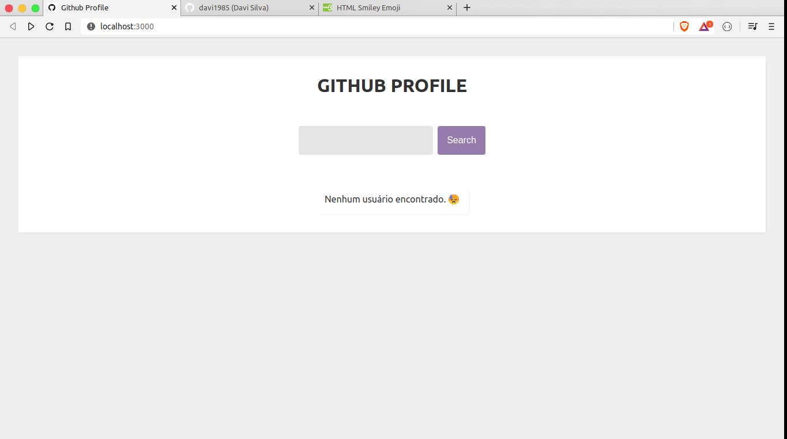
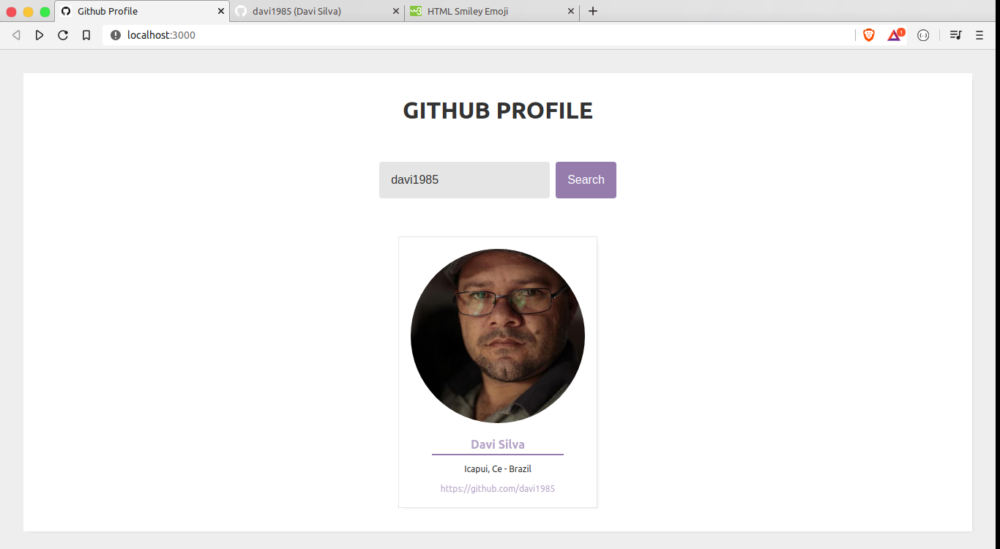

## Github Profile

Projeto desenvolvido no aulão do DevSuperior no Youtube.
Link: https://www.youtube.com/watch?v=IOJoJGDowEY

Desenvolvemos uma pequena aplicação que faz uma requisição a API do Github, onde devemos informar o nome de um usuário. Ao renderizar na tela mostramos dados obtidos da requisição como: nome, endereço, site e o avatar do usuário.

No aulão o professor fez usando Bootstrap, porém fiz todo o CSS na mão, aplicando _features_ do CSS como o Flex Box.

Segue alguns screenshots.

